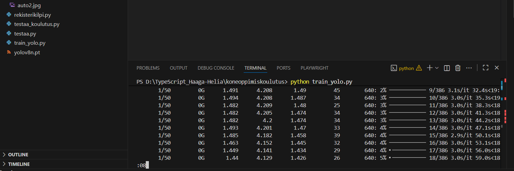
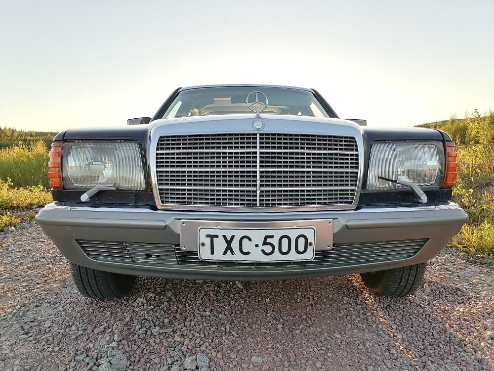

# Rekisterikilven tunnistus YOLOv8-mallilla ja Tesseract OCR:lla

Tämä projekti toteuttaa suomalaisen rekisterikilven tunnistuksen koneoppimisen ja OCR-tekniikan avulla. Järjestelmä tunnistaa kilven sijainnin YOLOv8-objektintunnistuksella ja lukee kilvessä olevat merkit Tesseract OCR -kirjastolla. Projekti on suunniteltu toimimaan valokuvilla, ja se toimii parhaiten suorakulmion mallisilla rekisterikilvillä. Tavoitteena oli rakentaa tarkka, dokumentoitu ja toimiva rekisterikilpien tunnistusratkaisu Pythonilla.

Aloitin projektin asentamalla tarvittavat Python-kirjastot komennolla `pip install ultralytics opencv-python pytesseract numpy` sekä erikseen `pip install datasets`. Käyttämäni teknologiat muodostivat kokonaisuuden, jossa YOLOv8 vastaa kilpien havaitsemisesta ja Tesseract merkkien lukemisesta. OpenCV tarjosi kuvankäsittelyn ja NumPy matemaattisen taustatoiminnallisuuden. Tesseract puolestaan käsittelee tekstin OCR-vaiheessa.

Projektissa hyödynnettiin avointa HuggingFace-datasettiä `keremberke/license-plate-object-detection`. Latasin datan .zip-tiedostona. Se oli valmiiksi YOLOv8-muodossa, jossa on omat kansiot kuville ja vastaavat .txt-tiedostot kilpien annotoiduilla koordinaateilla. Datasetti jaettiin train- ja val-osioihin, ja data.yaml määritteli YOLO-mallille käytettävät polut.

Aluksi yritin käyttää valmista YOLOv8n-mallia (yolov8n.pt) kilpien tunnistamiseen ilman koulutusta, mutta tulokset olivat täysin käyttökelvottomia. Malli ei tunnistanut rekisterikilpiä juuri lainkaan, mikä oli odotettavaa, koska se ei sisällä valmiiksi rekisterikilpiin liittyviä painotuksia. Tämän jälkeen siirryin kouluttamaan omaa mallia datasetin avulla.

Koulutin YOLOv8-mallin ensin pienellä määrällä eepokkeja. Malli toimi jo kohtuullisesti, mutta erityisesti neliömalliset kilvet aiheuttivat ongelmaa. Aluksi koulutuksessa oli käytössä vain muutama eepokki, joten kasvatin määrän viiteen, sitten viiteentoista ja lopulta viiteenkymmeneen. Koska käytössä ei ollut GPU:ta, jouduin kouluttamaan mallin CPU:lla, mikä hidasti prosessia useita tunteja. Viimeisin, yön yli ajettu 50 eepokin koulutus tuotti selvästi parhaimman tuloksen ja paransi mallin kykyä tunnistaa kilvet tehokkaasti.



OCR-vaiheessa ilmeni erikoisia merkkejä, joita ei normaaleissa kilvissä ole. Syynä oli se, että Tesseract on koulutettu yleisfontteihin eikä suomalaista kilpifonttia vastaavaan FE-Schrift-tyyppiseen kirjasimeen. Myös ruuvit ja jäljet rekisterikilvissä vaikuttivat tulokseen. Paransin tuloksia leikaten pois sinisen EU/FIN-kaistan, joka häiritsi OCR-tulkintaa. Toteutin poistamisen tunnistamalla sinisen värialueen OpenCV:n avulla ja rajaamalla sen kilvestä pois. Tämä paransi merkkien tunnistamista selvästi, erityisesti pitkissä kilvissä.

Testitulokset osoittivat, että YOLOv8 toimii rekisterikilpien paikannuksessa erittäin hyvin. Pitkät kilvet tunnistettiin luotettavasti ja neliömalliset kilvet toimivat myös huomattavasti aiempaa paremmin. Tesseract tuotti ajoittain edelleen virhemerkkejä, mutta EU-kaistan poistaminen ja kuvien esikäsittely (harmaasävy, threshold) vähensivät niitä merkittävästi.

Projektin kansiorakenne koostui YOLO-datasetistä, koulutusskriptistä ja erillisestä tunnistusskriptistä. Koulutuksen tulokset tallentuivat Ultralyticsin oletusrakenteen mukaisesti `runs/detect/trainX/weights/` -hakemistoon, josta käytettiin `best.pt` -mallia lopulliseen testaukseen.

Kehitysideoina jatkoon jäivät paremman OCR-mallin käyttö, sekä oman suomalaisen datasetin kerääminen. OCR:n tarkkuutta voisi parantaa valonkorjauksella. Lisäksi projektista voidaan laajentaa reaaliaikainen videodetektioversio tai rakentaa tunnistuksesta REST API -pohjainen palvelu.

---

## Projektin kansiorakenne

```text
koneoppimiskoulutus/
│
├── kuvat/
│   ├── *.jpg     #testikuvia
│   └── data.yaml
│ ├── test/
│ ├── train/
│ ├── valid/
├── runs/
│   └── detect/
│       └── trainX/
├── tulokset/
│
├── testaa_koulutus.py
├── train_yolo.py
├── yolov8n.pt
├── PSMmeanings.md
└── README.md

```

---

## YOLOv8-mallin koulutus

```python

from ultralytics import YOLO

model = YOLO("yolov8n.pt")
model.train(
    data="data.yaml",
    epochs=50,
    imgsz=416,
    batch=8,
    device="cpu"   # GPU ei toiminut
)

```

## YOLOv8 + Tesseractin käyttö rekisterikilpien tunnistamisessa

1. Kuvien käsittely
    - Ohjelma käy läpi kaikki kuvat tietystä kansiosta.
    - Jokainen kuva luetaan tietokoneen muistioon käsittelyä varten.

2. Kilven tunnistus YOLO-mallilla
    - YOLO on eräänlainen “silmä”, joka osaa etsiä kuvasta rekisterikilpiä.
    - Malli katsoo kuvan ja antaa koordinaatit, mitkä kertovat missä kilpi sijaitsee kuvassa.

3. EU/FIN-sinisen kaistaleen poistaminen
    - Suomalaisissa kilvissä vasemmassa reunassa on sininen EU/FIN-merkki.
    - Se ei kuulu kilven varsinaisiin kirjain- ja numero-merkkeihin, ja se voi hämätä tekstinlukua.
    - Funktio `remove_eu_band` tunnistaa sinisen värin ja leikkaa sen pois.
    - Näin jäljelle jää vain kilven varsinaiset merkit.

4. Kuvan muokkaus OCR:lle
    - Kilpialue muutetaan harmaasävykuvaksi (värit eivät enää häiritse).
    - Kuvaa suurennetaan kaksinkertaiseksi, jotta Tesseract näkee merkit selkeämmin.

5. Tekstien lukeminen Tesseractilla
    - Tesseract on ohjelma, joka lukee kuvia ja yrittää tunnistaa niissä olevia kirjaimia ja numeroita.
    - Se etsii vain hyväksyttyjä merkkejä (A–Z ja 0–9), joten virheelliset symbolit jätetään huomiotta.

6. Tulosten näyttäminen
    - Ohjelma piirtää laatikon kilven ympärille ja kirjoittaa kuvan päälle tunnistetun tekstin.
    - Tulokset tulostetaan myös konsoliin, jotta näkee nopeasti, mitä ohjelma on tunnistanut.

7. Tulosten tallentaminen
    - Jokaisen kuvan kilvet ja niiden sijainnit tallennetaan CSV-tiedostoon, jotta tiedot voi myöhemmin käyttää esimerkiksi analysointiin tai raportointiin.

---



---

Nyt siis tunnistus toimii periaatteessa, mutta se vaatisi suuremman määrän kuvia ja eepokkeja. Jos kuva ei ole suoraan edestäpäin, tekoälymalli todennäköisesti epäonnistuu. Toisaalta ohjelmat, jotka tarvitsevat rekisterikilven tunnistusta, saavat kuvan yleensä läheltä, edestä tai takaa, jolloin tunnistus onnistuu luotettavammin.

Opin tässä tehtävässä tuntemaan tekoälykoulutuksessa käytettävää sanastoa, sekä tekoälykoulutuksen periaatteen. 

---

## Lähteet
- Ultralytics YOLOv8
- Tesseract OCR
- OpenCV
- HuggingFace Datasets
- StackOverFlow: https://stackoverflow.com/questions/71516635/how-to-setup-tesseract-ocr-properly
